1. Part 1  
* вывод команды cat /etc/issue:

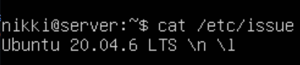

2. Part 2
* создание нового пользователя:

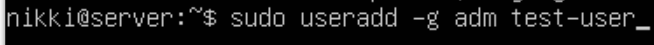

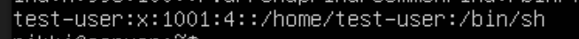

3. Part 3
* Изменение названия машины вида user-1:

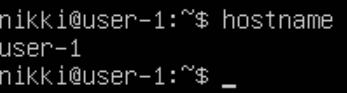

* Установка временной зоны:

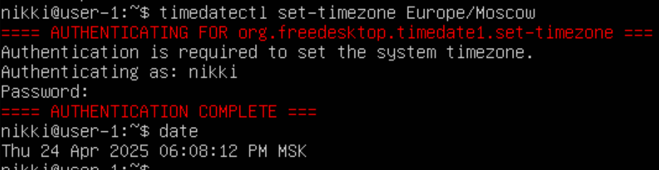 

* Выввод названий сетевых интерфейсов:

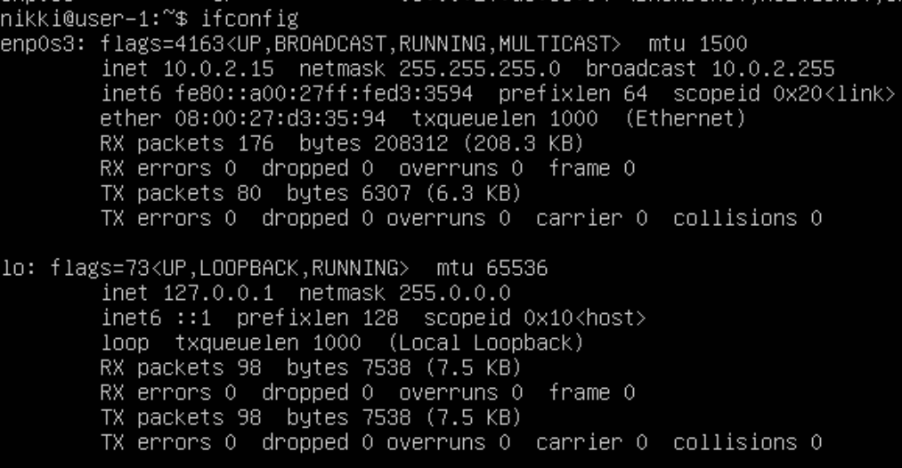

    * lo(loopback) - виртуальный интерфейс, который по умолчанию присутствует в любом linux. Используется для отладки сетевых программ и запуска серверных приложений. C lo всегда связан ip 127.0.0.1

* Получение ip-адреса от DHCP(?):

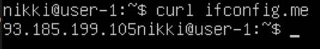

    * DHCP - Dynamic Host Configuration Protocol. 

* Внешний ip-адрес шлюза(?):

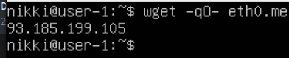

* Внутренний ip-адрес шлюза(?):

* Задал статичные настройки ip, gw, dns(1.1.1.1 и 8.8.8.8):

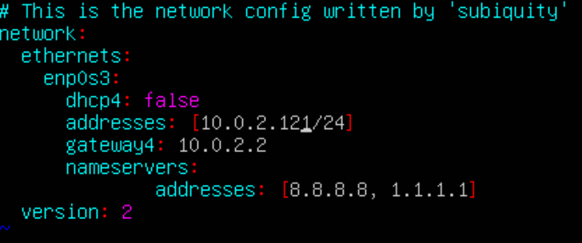

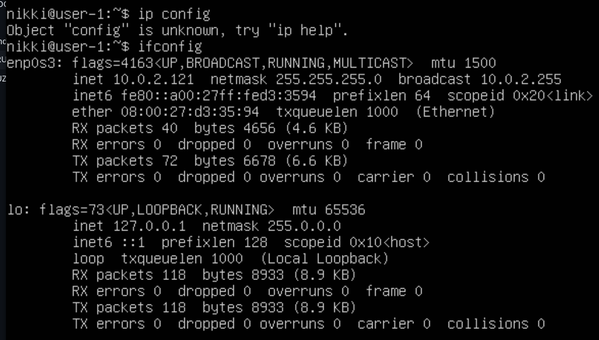

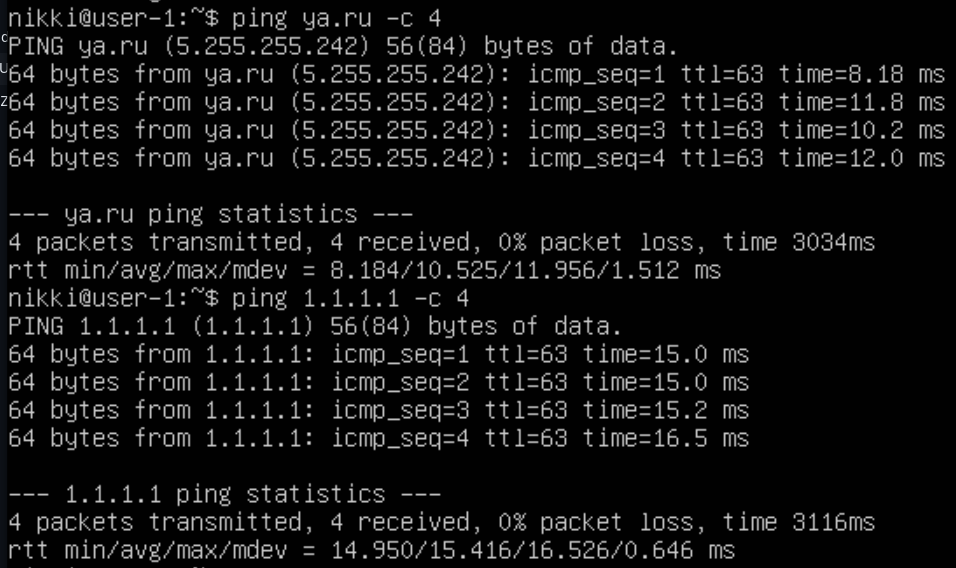
